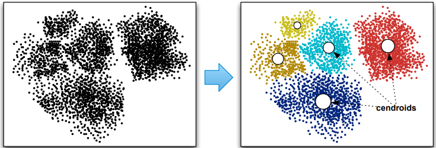

# Projeto Final - Clusterização K-Means Paralelo

Este repositório contém o material base para o projeto final da disciplina. Após dominarem problemas clássicos de computação paralela e distribuída, o desafio final é aplicar seus conhecimentos de paralelismo e otimização a um problema fundamental de Machine Learning. O desafio deste projeto é **paralelizar e otimizar um código sequencial fornecido** que implementa o algoritmo de clusterização K-Means, visando o máximo de desempenho em um grande volume de dados.

---

## Índice

- [O Problema](#problema)
- [Estrutura do Projeto](#estrutura-do-projeto)
- [Como Usar e Depurar](#como-usar)
- [Itens Entregáveis](#itens-entregaveis)
- [Critérios de Avaliação](#criterios-avaliacao)

---

<a id="problema"></a>
## O Problema Computacional: K-Means Clustering

O K-Means é um algoritmo que visa particionar um conjunto de `M` pontos de dados, localizados em um espaço de `D` dimensões, em `K` clusters distintos.  
A ideia é que os pontos dentro de um mesmo cluster sejam os mais similares (próximos) possível, e os pontos em clusters diferentes sejam os mais distintos (distantes) possível.
Abaixo você pode conferir um exemplo no qual 5 clusters (lado direito) são formados a partir de um conjunto inicial de pontos (lado esquerdo).



O algoritmo é composto por quatro etapas principais:

1. **Inicialização:** Selecione `K` pontos de dados aleatoriamente para serem os "centroides" iniciais dos clusters.  
2. **Fase de Atribuição (Assignment):** Para cada um dos `M` pontos, calcule a distância Euclidiana até cada um dos `K` centroides e atribua o ponto ao mais próximo.  
3. **Fase de Atualização (Update):** Para cada um dos `K` clusters, recalcule o centroide como a média dos pontos atribuídos.  
4. **Convergência:** Repita os passos 2 e 3 por um número fixo de iterações.

O seu trabalho é **paralelizar a implementação sequencial fornecida** para processar um dataset massivo de forma eficiente.

---

<a id="estrutura-do-projeto"></a>
## Estrutura do Projeto

Os seguintes arquivos são fornecidos neste repositório:

- `dataset.txt`: Arquivo de dados oficial contendo **1 milhão de pontos** para avaliação final de desempenho.
- `gerador_dataset.c`: Código para gerar datasets de tamanhos customizados — essencial para depuração.
- `kmeans_sequencial.c`: Implementação de referência (baseline).
- `kmeans_openmp.c`: Versão paralela a ser implementada com **OpenMP**.
- `kmeans_pthreads.c`: Versão paralela a ser implementada com **Pthreads**.
- `kmeans_mpi.c`: Versão distribuída a ser implementada com **MPI**.
- `avaliador.py`: Script que automatiza compilação, execução e análise de desempenho.
- `README.md`: Este arquivo.

O arquivo `kmeans_sequencial.c` é o seu ponto de partida e baseline para medir o ganho de desempenho das versões paralelas.

---

<a id="como-usar"></a>
## Como Usar e Depurar o Projeto

É crucial seguir um fluxo de trabalho eficiente para implementar e testar suas versões paralelas.

### Pré-requisitos

Certifique-se de ter os seguintes softwares instalados (Linux/macOS/WSL):

- **Compilador C:** `gcc`
- **Implementação MPI:** `OpenMPI`, `MPICH` ou similar (que forneça `mpicc` e `mpirun`)
- **Python 3.6+** (sem dependências externas)

---

### 1. Implementação das Versões Paralelas

Modifique os arquivos `kmeans_openmp.c`, `kmeans_pthreads.c` e `kmeans_mpi.c` para implementar as versões paralelas.  
Use o `kmeans_sequencial.c` como referência.

> 💡 Dica: organizem-se em equipe para dividir as tarefas. As versões paralelas devem **replicar a mesma lógica de entrada, medição de tempo e saída** da versão sequencial para compatibilidade com o `avaliador.py`.

---

### 2. Geração de Datasets para Depuração

O arquivo fornecido `dataset.txt` possui 1 milhão de pontos e será usado para
testar o desempenho final das versões do código paralelo que vocês produzirem. Na fase de desenvolvimento, vocês provavelmente vão necessitar usar um conjunto menor de pontos para facilitar a depuração. Para isso, é fornecido junto com o projeto um gerador de pontos. Para compilar, faça:


**Compilação do Gerador:**

```bash
gcc -o gerador_dataset gerador_dataset.c -O3
```

**Exemplo de Geração:**

```bash
./gerador_dataset 3000 5 1000 debug_data.txt
```

Cria `debug_data.txt` com 3000 pontos, 5 dimensões e valores entre 0 e 1000.

---

### 3. Compilação Manual dos Programas

Embora o `avaliador.py` compile automaticamente o projeto (mais detalhes [aqui](#avaliador)), seu grupo inicialmente pode precisar compilar os programas de forma separada para fins de depuração. Para isso, uso os seguintes comandos direto no prompt de um console bash:

**Compilar versão sequencial:**

```bash
gcc -o kmeans_sequencial kmeans_sequencial.c -O3
```

**OpenMP:**

```bash
gcc -o kmeans_openmp kmeans_openmp.c -fopenmp -O3
```

**Pthreads:**

```bash
gcc -o kmeans_pthreads kmeans_pthreads.c -lpthread -O3
```

**MPI:**

```bash
mpicc -o kmeans_mpi kmeans_mpi.c -O3
```

---

### 4. Execução Manual e Depuração

Para execução na fase de desenvolvimento, vocês podem usar os comandos abaixo.
Prestem atenção para que o número de pontos (`M_pontos`), dimensões (`D_dimensoes`) e clusters (`K_clusters`) sejam
idênticos ao valores que vocês usaram quando geraram o `arquivo_dados`
manualmente. 

**Formato geral:**

```bash
./<executavel> <arquivo_dados> <M_pontos> <D_dimensoes> <K_clusters> <I_iteracoes>
```

**Exemplos:**

Sequencial:

```bash
./kmeans_sequencial debug_data.txt 1000 5 10 20
```

OpenMP (4 threads):

```bash
OMP_NUM_THREADS=4 ./kmeans_openmp debug_data.txt 1000 5 10 20
```

MPI (4 processos):

```bash
mpirun -np 4 ./kmeans_mpi debug_data.txt 1000 5 10 20
```

**Saída esperada:**

```
0.001234
543210
```

A primeira linha é o tempo (double) e a segunda é o checksum (long long).
Essa saída é usada pelo `avaliador.py` para verificar corretude.

---

<a id="avaliador"></a>
### 5. Execução do Avaliador de Desempenho

Quando as versões estiverem corretas, execute o avaliador no dataset oficial:

```bash
python3 avaliador.py
```

O script:

1. Compila todas as versões.
2. Executa a versão sequencial para obter o checksum de referência.
3. Roda cada versão 30 vezes, capturando tempo e checksum.
4. Exibe uma tabela comparativa de desempenho e corretude.

**Exemplo de saída:**

```
--- Resumo dos Resultados (Checksum de Referência: 9876543210) ---
Versão          | Tempo Médio (s)      | Speedup       | Corretude      
---------------------------------------------------------------------
Sequencial      | 25.1234              | 1.00x         | (30/30)        
OpenMP          | 3.2456               | 7.74x         | (30/30)        
Pthreads        | 3.4567               | 7.27x         | (30/30)        
MPI             | 3.1234               | 8.04x         | (29/30)        
---------------------------------------------------------------------
```

> 💡 Neste exemplo, a versão MPI falhou em uma execução, o que é mostrado na coluna “Corretude”.

---

<a id="itens-entregaveis"></a>

## Itens Entregáveis

Todos os artefatos do projeto devem ser versionados em um **repositório Git público**.
O link deve ser informado no item `Entrega` via **Google Classroom**.
📦 **Não envie arquivos `.zip`.**

Sugerimos que cada grupo clone este repositório para começo de trabalho. Basta
posteriormente informar o link para ele via Google Classroom, como apontado
anteriormente. O repositório deve necessariamente conter:

1. `kmeans_openmp.c`
2. `kmeans_pthreads.c`
3. `kmeans_mpi.c`
4. `relatorio.pdf` ou `relatorio.md`


---

### Sobre o Relatório

O relatório é **parte fundamental** da avaliação e deve conter:

#### Estratégias de Paralelização

* **Fase de Atribuição:** como os pontos foram divididos entre threads/processos;
* **Fase de Atualização:** como a soma e contagem dos pontos foram paralelizadas.

#### Análise de Desempenho e Discussão

* Speedup médio e tempo de execução comparado ao baseline.
* Discussão do overhead e escalabilidade.
* Impacto da comunicação e sincronização (especialmente no MPI).

> 💡 Dica: inclua gráficos e tabelas comparativas no relatório.

---

<a id="criterios-avaliacao"></a>

## Critérios de Avaliação

A nota será composta pela **funcionalidade, desempenho e qualidade** do
trabalho. Também serão considerados:

1. **Desempenho Relativo:** ranking de speedup das equipes.
2. **Qualidade da Implementação e Versionamento:** eficiência, clareza do código e histórico de commits.
3. **Profundidade do Relatório:** clareza na explicação das estratégias e qualidade das análises.

Equipes com desempenho e qualidade similares podem receber a mesma nota. A classificação não é estritamente exclusiva.

**Importante**

Em casos de suspeita de compartilhamento de código entre os grupos, estes
serão chamados para uma conversa e pontecialmente poderão ter suas notas zeradas
(todos os grupos envolvidos)! Aproveite o projeto final para fazer uma
auto-análise sincera da compreensão que você obteve da disciplina e evite aquele pensamento de *passar de qualquer jeito*.

---

✨ **Boa sorte e bom trabalho!**
Dominar a paralelização deste problema mostrará seu domínio prático de computação paralela e distribuída.

